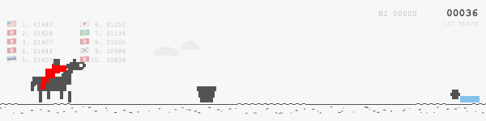
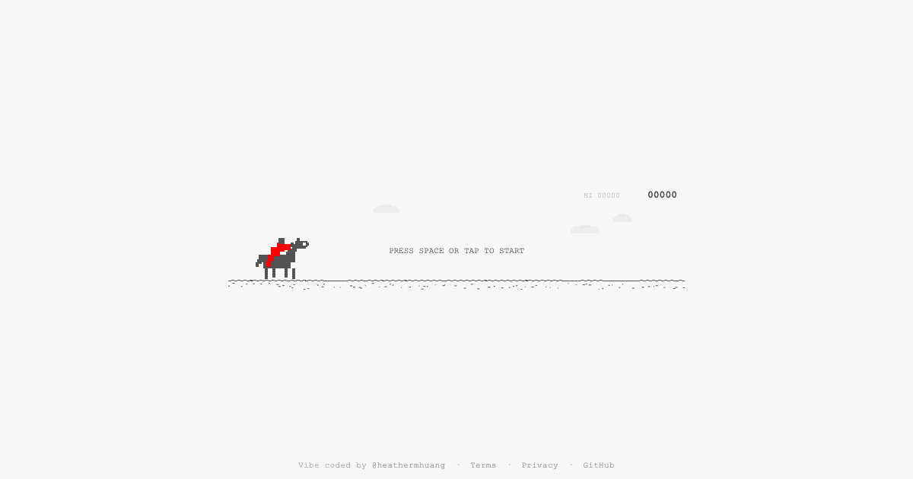
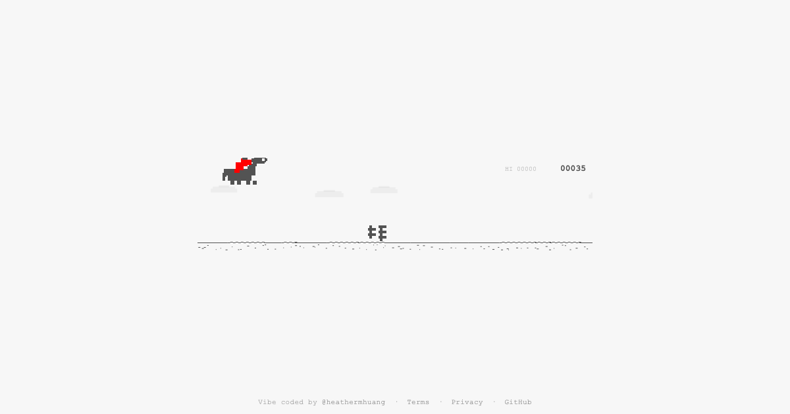
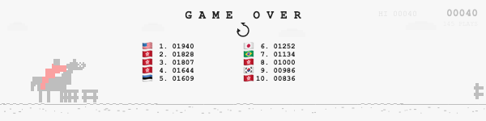

# Horse.Horse

A Chrome Dinosaur Game clone with a pixel-art horse and jockey. Jump over racing obstacles, climb the global leaderboard, and chase ghost markers left by top players.

**Play now at [horse.horse](https://horse.horse)**



## Features

- **Pixel-art horse + jockey** with running, jumping, ducking, and idle fidget animations
- **Racing obstacles** — hurdles (low + tall), hedges, oxers (double fences), water jumps, and birds
- **Obstacle grouping** — multiple obstacles spawn together as speed increases
- **Global leaderboard** — top 20 scores displayed with country flags, powered by Cloudflare D1
- **Ghost markers** — each leaderboard entry becomes a spectral flag on the track; pass one and you'll see the rank, flag, and score with a chime
- **Day/night cycle** — palette inverts every 700 points
- **Web Audio SFX** — jump, hit, score milestone, and ghost-pass sounds, all synthesized in the browser
- **Full Chrome Dino parity** — delta-time physics, variable jump height, speed drop (fast fall), gap-based spawning, tab-pause, restart cooldown, score flash, blink animation, intro slide, bumpy horizon, dynamic clouds

## Screenshots

| Idle | Running | Jumping | Game Over |
|------|---------|---------|-----------|
|  |  |  |  |

## Controls

| Action | Keyboard | Mobile |
|--------|----------|--------|
| Jump | `Space` / `Arrow Up` | Tap |
| Duck | `Arrow Down` | *(coming soon)* |
| Fast fall | `Arrow Down` while airborne | *(coming soon)* |
| Restart | `Space` / `Arrow Up` / Tap after death | Tap |

## Tech Stack

- **Frontend** — vanilla JS, single-file game (`js/game.js`), Canvas 2D, no build step, no dependencies
- **Backend** — Cloudflare Workers + D1 (serverless SQLite) for the leaderboard API
- **Hosting** — Cloudflare Workers with static assets, zone-routed to `horse.horse`
- **Analytics** — Google Analytics (G-SECK3FR5SR)

## Architecture

```
index.html              <- minimal shell: canvas + script tag
js/game.js              <- entire game in a single IIFE (~1200 lines)
worker.js               <- Cloudflare Worker: GET/POST /api/scores + static fallback
css/style.css           <- centered layout, pixelated canvas rendering
terms.html              <- Terms of Service
privacy.html            <- Privacy Policy
wrangler.toml.example   <- Cloudflare config template (copy to wrangler.toml)
```

### Leaderboard API

| Endpoint | Method | Description |
|----------|--------|-------------|
| `/api/scores` | `GET` | Returns top 20 scores as JSON, cached 30s |
| `/api/scores` | `POST` | Submit a score with anti-cheat validation |

**Anti-cheat measures:**
- Physics plausibility check (score vs. play time)
- Max speed validation (rejects impossible speeds)
- Rate limiting (1 submission per 5s per session)
- Score cap at 99,999
- Only top-20-worthy scores are stored
- Country auto-detected via Cloudflare's `CF-IPCountry` header

## Local Development

```bash
# Start the local server
node server.js
# Open http://localhost:8765
```

No build step, no npm install, no dependencies. Just a static file server.

## Deployment

```bash
# Copy and fill in your Cloudflare IDs
cp wrangler.toml.example wrangler.toml
# Edit wrangler.toml with your account_id, zone_id, database_id

# Create the D1 database
npx wrangler d1 create horse-leaderboard
npx wrangler d1 execute horse-leaderboard --remote --command "CREATE TABLE IF NOT EXISTS scores (id INTEGER PRIMARY KEY AUTOINCREMENT, score INTEGER NOT NULL, country TEXT DEFAULT 'XX', session_id TEXT, max_speed REAL, obstacles_passed INTEGER, created_at DATETIME DEFAULT CURRENT_TIMESTAMP)"

# Deploy
npx wrangler deploy
```

Requires a Cloudflare account with:
- Workers plan
- D1 database
- DNS zone for `horse.horse`

## Vibe Coded

Built with vibes by [@heathermhuang](https://h.im/?ref=horse.horse) and Claude.

## License

MIT
